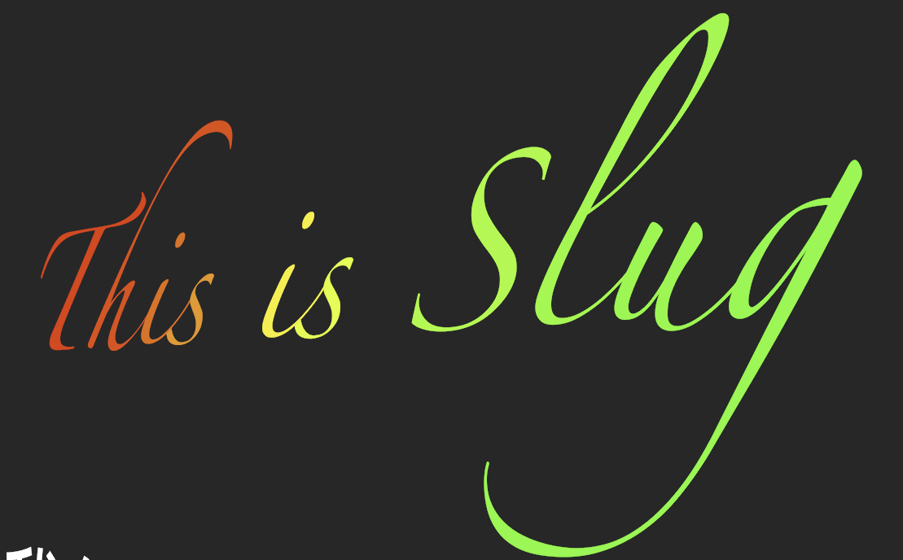

# Slug in Metal

This repository contains an implementation of the [Slug](https://sluglibrary.com) text rendering algorithm, which was [donated to the public domain](https://terathon.com/blog/decade-slug.html) in March 2026. It accompanies [this article](https://metalbyexample.com/slug) on Metal by Example.

## Sample App Controls

**Scroll**: Zoom in/out  
**Left mouse drag**: pan text  
**Right mouse drag**: rotate text  
